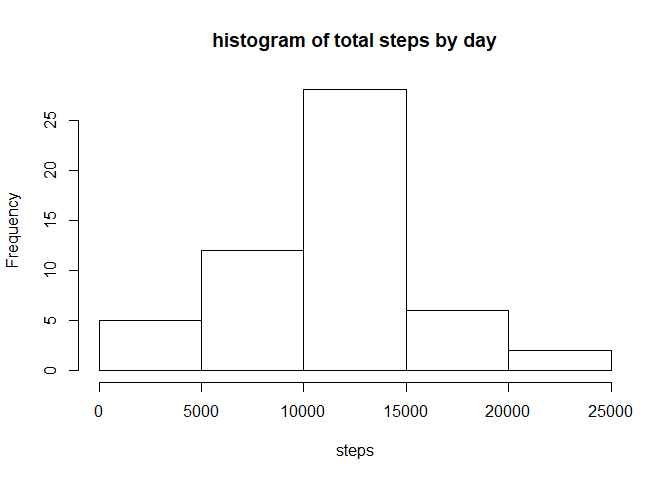
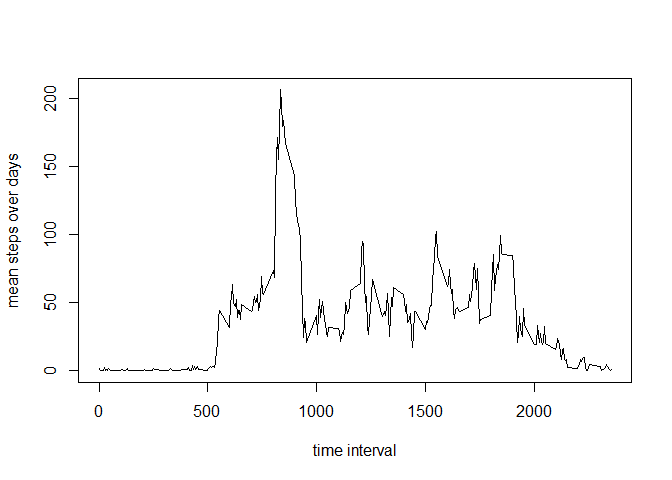
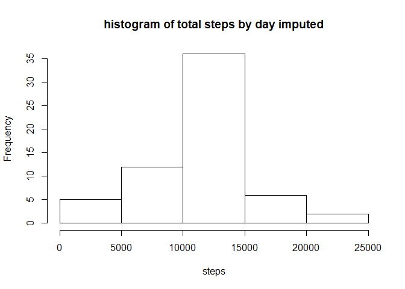

## Load libraries 

```r
library(ggplot2)
library(dplyr)
library(tidyr)
```

## Read the data 
Make sure that the working directory contains the file activity.csv.


```r
data <- read.csv('activity.csv')
```

## What is mean total number of steps taken per day?
1) Calculate the total number of steps taken per day

```r
d <- data %>% group_by(date) %>% summarise(steps_by_day = sum(steps))
```
2) A histogram of the total number of steps taken each day

```r
hist(d$steps_by_day, main = "histogram of total steps by day", xlab = "steps")
```

<!-- -->

3) The mean and median of the total number of steps taken per day

```r
mean(d$steps_by_day, na.rm = T)
```

```
## [1] 10766.19
```

```r
median(d$steps_by_day, na.rm = T)
```

```
## [1] 10765
```

## What is the average daily activity pattern?
1) Time series plot of the 5-minute interval (x-axis) and the average number of steps taken, averaged across all days (y-axis)

```r
by_int <- data %>% group_by(interval) %>% summarise(m = mean(steps,na.rm = T))
plot(by_int$interval,by_int$m, type = "l",
     xlab = "time interval", ylab = "mean steps over days")
```

<!-- -->

2) Which 5-minute interval, on average across all the days in the dataset, contains the maximum number of steps?

```r
by_int[which(by_int$m == max(by_int$m)),]
```

```
## # A tibble: 1 x 2
##   interval     m
##      <int> <dbl>
## 1      835  206.
```
## Imputing missing values
1) Calculate and report the total number of missing values in the dataset

```r
sum(is.na(data))
```

```
## [1] 2304
```
2) Filling in all of the missing values in the dataset with the mean for that 5-minute interval.
3) Input into a new equivalent dataset dataI.

```r
dataI <- data %>% group_by(interval) %>%
      mutate(steps = ifelse(is.na(steps), mean(steps,na.rm = T), steps))
```
4) histogram of the total number of steps taken each day and Calculate and report the mean and median total number of steps taken per day. Do these values differ from the estimates from the first part of the assignment? What is the impact of imputing missing data on the estimates of the total daily number of steps?


```r
dI <- dataI %>% group_by(date) %>% summarise(steps_by_day = sum(steps))
hist(dI$steps_by_day, main = "histogram of total steps by day imputed",
     xlab = "steps")
```

<!-- -->


```r
mean(dI$steps_by_day, na.rm = T)
```

```
## [1] 10766.19
```


```r
median(dI$steps_by_day, na.rm = T)
```

```
## [1] 10766.19
```
The mean value did not change after imputing and the median changed ever so slightly. The main difference is seen in the histogram, where there are now more days with an expected value of steps, because the NaN days were replaced by the averge values. 

## Are there differences in activity patterns between weekdays and weekends?
1) Create a new factor variable in the dataset with two levels – “weekday” and “weekend” indicating whether a given date is a weekday or weekend day.

```r
dataI$date <- as.Date(dataI$date)
dataI$weekdays <- as.factor(ifelse(weekdays(dataI$date) == "Saturday" | 
                         weekdays(dataI$date) =="Sunday",
                         "weekend","weekday"))
```
2) Make a panel plot containing a time series plot of the 5-minute interval (x-axis) and the average number of steps taken, averaged across all weekday days or weekend days (y-axis).

```r
dataIs <- dataI %>% group_by(interval,weekdays) %>% 
      summarise(steps = mean(steps))
p <- ggplot(dataIs, aes(x = interval, y = steps)) + 
      geom_line() +
      facet_wrap(~weekdays)
p
```

<!-- -->


